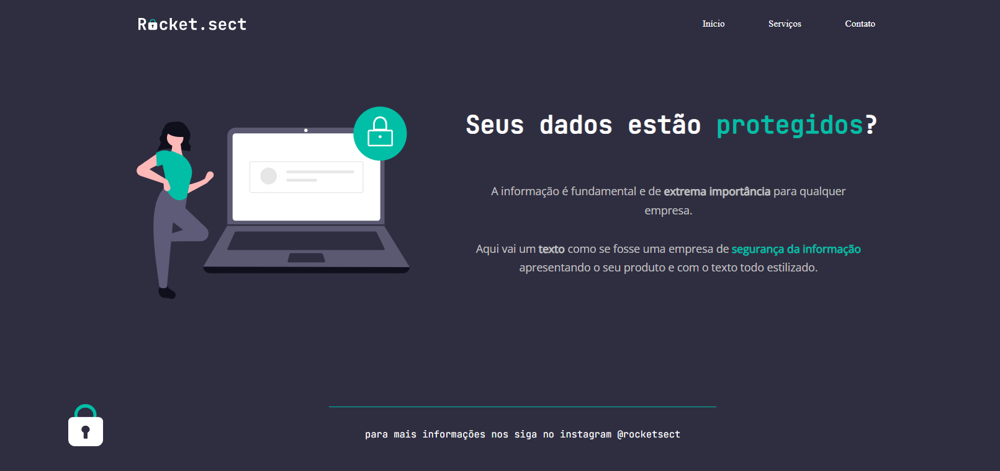

<h1 align="center"> Explorer </h1> 

 Stage 2 - Recriando Layout  "site para ter seus dados protegidos" 

  <a href="#-tecnologias">Tecnologias</a>&nbsp;&nbsp;&nbsp;|&nbsp;&nbsp;&nbsp;
  <a href="#-projeto">Projeto</a>&nbsp;&nbsp;&nbsp;|&nbsp;&nbsp;&nbsp;
  <a href="#-layout">Layout</a>&nbsp;&nbsp;&nbsp;|&nbsp;&nbsp;&nbsp;
  <a href="#memo-licença">Licença</a>

 

  

## 🚀 Tecnologias

Esse projeto foi desenvolvido com as seguintes tecnologias:

- HTML e CSS;
- Git e Github;
- Figma.

## 💻 Projeto

O projeto é uma criação de um landing page para aplicar os conhecimendos básicos de HTML, CSS e Acessibilidade.

## 🔖 Layout

- [Acesse o projeto finalizado, online](https://giovannakethleen.github.io/Stage2Layout2/)
- Você pode visualizar o layout do projeto através [DESSE LINK](https://www.figma.com/file/OCoqMUrtFBfy1DO8cmF43P/Explorer-Copy?fuid=1283155027471539453). É necessário ter conta no [Figma](https://figma.com) para acessá-lo.

## :memo: Licença

Esse projeto está sob a licença MIT.

  

---

 Feito por Giovanna Kethleen ♥ 

